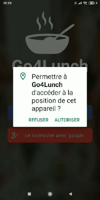
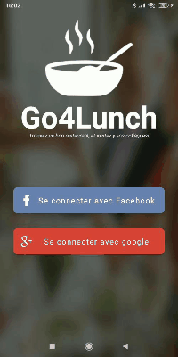
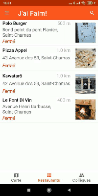
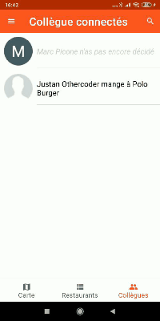
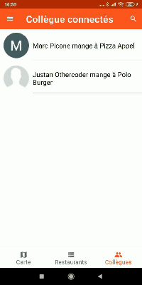
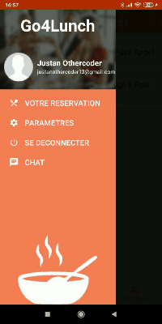
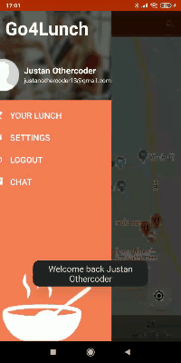

# Todoc

 ## 1. Requierements.

+ **Compile Sdk Version :** 29.
+ **Min Sdk Version :** 19.
+ **JavaVersion :** 1_8.

## 2. Preview.

### Go4Lunch presentation.

+ presentation of the app structure and more : https://slides.com/justanothercoder/deck-0101ce
  
### Authenticate with Google or Facebook.

### Choose where to eat.

### Workmates' changes live update

### Filter restaurants or workmates on restaurant name.

### Change language and more

### Live chat with your workmates

 ### Preview, principal fonctionalities :
  + Authenticate with Google or Facebook.
  + Know restaurants near from you.
  + Choose where to eat.
  + Filter restaurants or workmates on restaurant name.
  + Change application language.
  + Chat with workmates.

## 3. Work done

+ Single activity application.
+ Multi module application
+ Clean architecture.
+ Dependencies injection with Hilt.
+ Reactive programation with RxJava.
+ Http calls with retrofit
+ Navigation with navigation component
+ Use FireBase to authenticate, save data on FirebaseDatabase and send message with FCM.
+ Use Maps and google place.