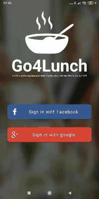

# Todoc

 ## 1. Requierements.

+ **Compile Sdk Version :** 29.
+ **Min Sdk Version :** 19.
+ **JavaVersion :** 1_8.

## 2. Compile project.

+ Open **ANDROID STUDIO**.
+ Click on **File ->New -> Project from Version Control ->Git**.
+ Enter the following URL : https://github.com/JustAnOtherCoder13/Go4Lunch.git
+ Optimize import by right clicking on app folder and choose "Optimize Import".
+ Run the project by clicking **Play** button in the tool bar on top.

## 3. Preview.

 ### Preview, principal fonctionalities :
  + Authenticate with Google or Facebook.
  + Know restaurants near from you.
  + Choose where to eat.
  + Filter restaurants or workmates on restaurant name.
  + Change application language.
  + Chat with workmates.

## 4. Work done

+ Single activity application.
+ Multi module application
+ Clean architecture.
+ Dependencies injection with Hilt.
+ Reactive programation with RxJava.
+ Http calls with retrofit
+ Navigation with navigation component
+ Use FireBase to authenticate, save data on FirebaseDatabase and send message with FCM.
+ Use Maps and google place.
